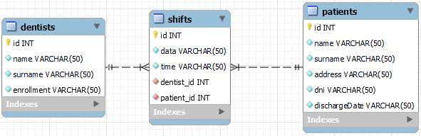

# DentalOffice
## Sistema de reserva de turnos odontologicos. 

Cuenta con una base de datos la cual guarda pacientes y dentistas, relacionados por turnos, 
los cuales pueden ser asignados a ambos mediante su ID.


Los pacientes, los dentistas y los turnos pueden:
* ser obtenidos mediante ID
* ser creados
* ser modificados por campo o en su totalidad
* ser eliminados

Además, los turnos pueden ser consultados mediante DNI de paciente.

***Ni pacientes ni dentistas pueden ser eliminados si tienen un turno asignado.***

Para mas informacion direigirse al siguiente [link](docs/swagger.yaml)

### Lograr que el proyecto funcione
Datos de importancia:
* Se debe generar un archivo .env en la raiz del proyecto con las siquientes variables:

  ```
  HOST=localhost:8080
  MYSQL_USER=<user>
  DATABASE_PASSWORD=<password>
  DATABASE_URL=localhost
  DATABASE_PORT=<port>
  DATABASE_NAME=dentaloffice
  TOKEN=1234
  ```
Donde:
* DATABASE_PORT dependerá de su puerto
* MYSQL_USER dependerá de su usuario
* DATABASE_PASSWORD dependerá de su password

Se debe generar la base de datos encontrada en [el siguiente archivo](db.sql)

Archivo con colección para pruebas en [Postman](postman_collection.json) 
